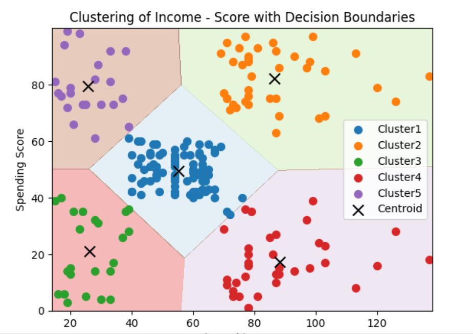
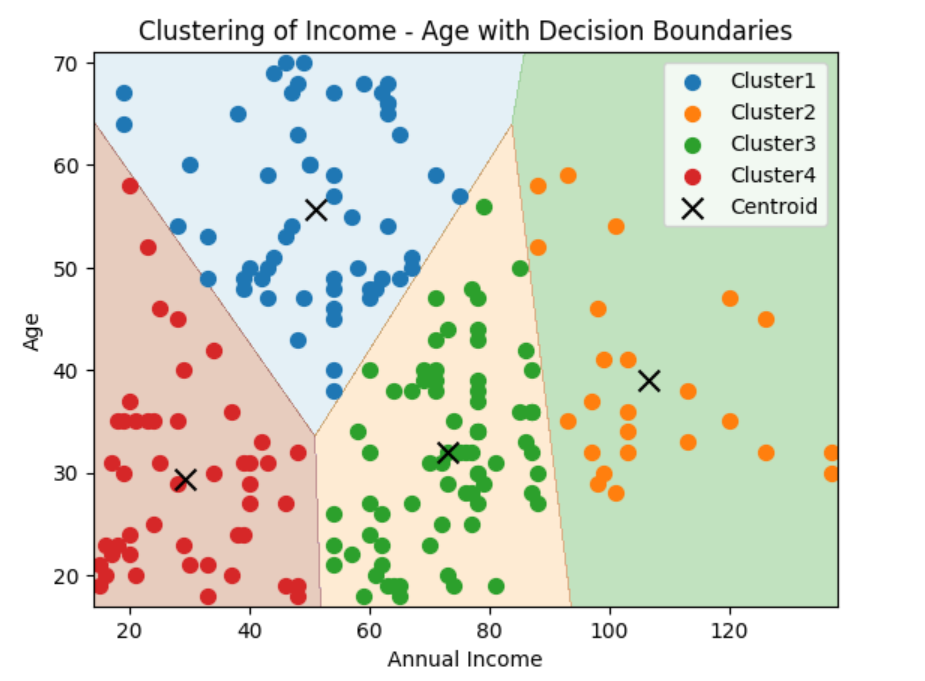
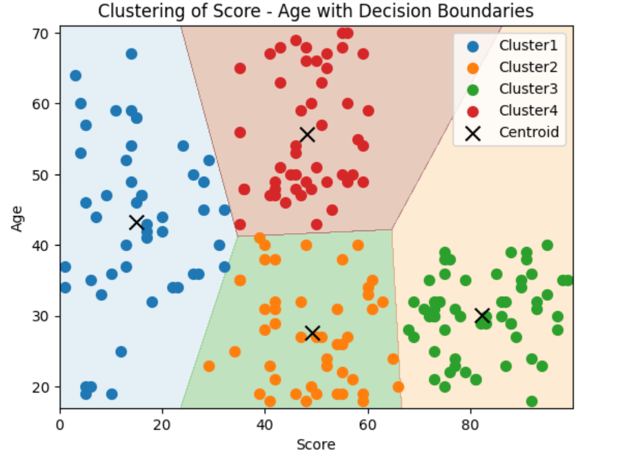
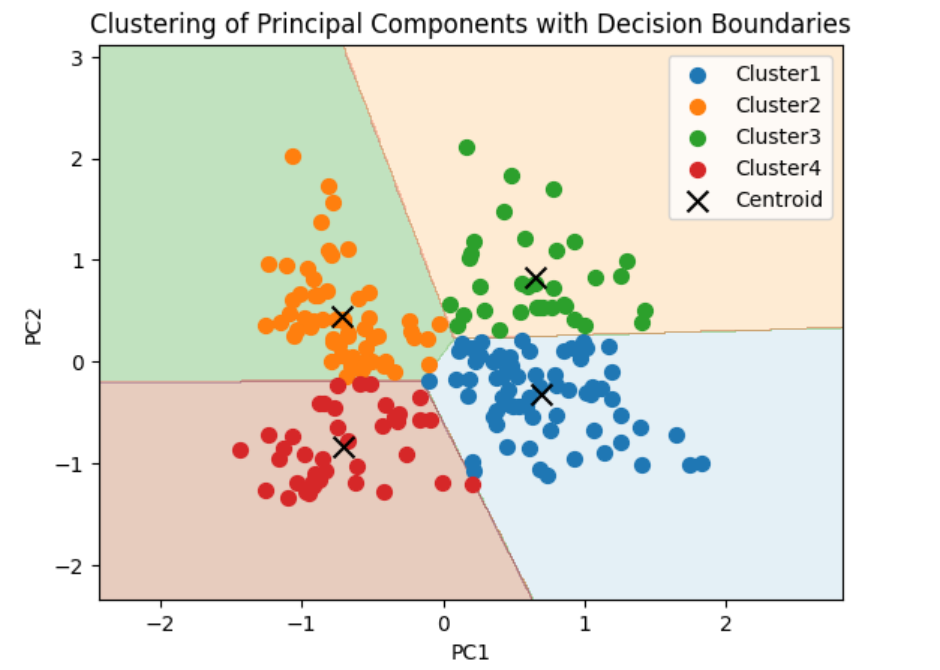

# Customer Segregation

To understand the behaviour of the customers visiting a shoping mall, we implemented a unsupervised machine learning model to segregate the customers.

#### Steps involved:

        1. Understanding the Data
        2. Exploratory Data Analysis
        3. Data Pre-Processing
        4. Model Building

## Understanding the Data:

Made use of a dataset containing the details of customers visiting a shopping mall.

You can find the dataset here:

[_mall_customers_dataset_](https://drive.google.com/file/d/19jhYZQz1EIVsgeeu42KjaCKU4fOuVcEv/view?usp=sharing)

The dataset has the columns as follows:
['CustomerID', 'Gender', 'Age', 'Annual Income (k$)',
'Spending Score (1-100)']

Here the customers can be segregated by taking Age/Annual Income/Spending Score/Gender as features. 
## Exploratory Data Analysis:

EDA is one of the main part of the model implementation to know what the data can reveal beyond the model formation.

With the columns of the combined dataframe we can execute some analysis.

Summary of EDA:

    1. Male and Female percentage of customers is in the ratio of around 44 : 56.

     By ploting the boxplots, we got the information of each column as follows:
        1. Age range of female customers is from just below  30  to below  50  whereas male customers Age ranges from below  30  to just above  50 .
        2. Annual Income for female customer's income starts from  40k  whereas male customer's is just above this value.
        3. Median Annual Income for female customer's is near about  60k  and for male customer's is just above it.
        4. Spending Score for Female customers starting at around 35 ranging upto near 75, whereas for male customers it was around 25 and ranging just below 75.
        5. Median Spending Score for both male and female customers is same around 55.
        
## Data Pre-Processing:

Distribution of Age and Annual Income (k$) is positively or righly skewed.

Spending Score data distribution is kind of negatively or left skewed and also similar to the Head and Shoulder pattern observed in stock charts.

It displays Score rising to a peak and then declines back to the base of the prior up-move.

Something similar can be observed with the 2 shoulders forming around the values 20 & 80 with head being centered in between 40 - 60.

And the ranges of all columns were not that of vast range, all the columns were in the range around 0-150 only. So no feature Scaling is required for this dataset.

## Model Building

In the model building, we used K-Means Clustering model for segregating the customers.

Took three different pairs for segregating the customers based on them. The three different pair are :

        1. Annual Income and Spending Score
        2. Annual Income and Age
        3. Spending Score and Age

For determining the number of clusters, we used _Elbow plot_ which is the plot between _Within Clusters Sum of Squares (WCSS)_ and number of _clusters_. We can also find the number of clusters using _Silhouette  Score Method_.

From both the methods, we found out number of clusters were 5 for (Annual Income, Spending Score) pair.

        we can see the customers with average income and average score were more compared to others.

From both the methods, we found out number of clusters were 4 for (Annual Income, Age) pair.

        we can see the customers with average income were more compared to others in all the age groups .

From both the methods, we found out number of clusters were 4 for (Spending Score Age) pair.

        we can see the customers below age 40 are having maximum spending score and above 40 are having low or average spending score.

Before PCA, done some feature scaling using Robust Scaler on the columns. 
After done with those three pairs, did PCA on the three columns, and reduced the 3D data into 2D data. Then implemented same process as done to the above pairs.

From both the methods, we found out number of clusters were 4 for Principal Components.

